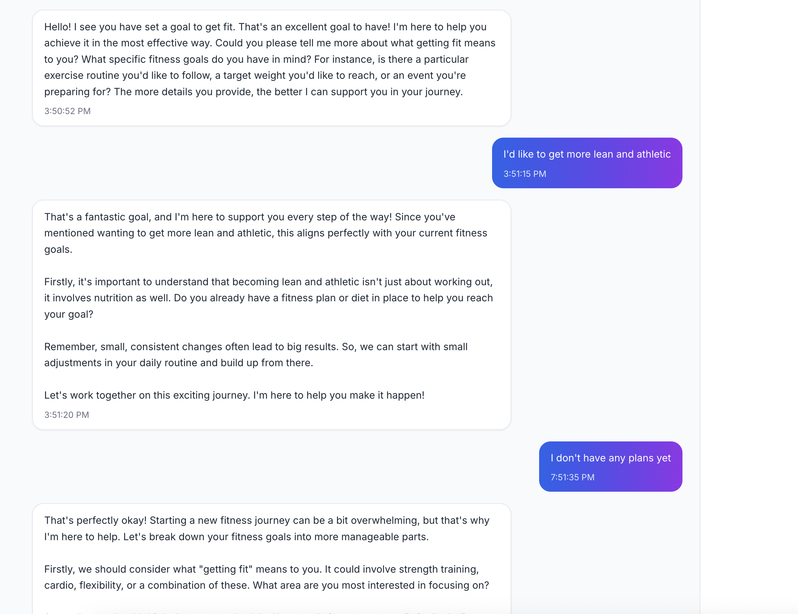

# 🤖 AI Life Coach

> DISCLAIMER: This project idea and code have been generated mostly through prompts to AI assistants as a way to get more familiar with prompt engineering as well as the tech stack being used (i.e. Node.js and MongoDB).
> An intelligent, context-aware life coaching application that helps users set, track, and achieve their goals through personalized AI guidance.


[](https://nodejs.org/)
[](https://reactjs.org/)
[](https://www.mongodb.com/)
[](https://openai.com/)
[](https://aws.amazon.com/)
[](LICENSE)

## ✨ Features

### 🎯 **Smart Goal Tracking**
- Create and manage short-term and long-term goals
- Visual progress tracking with milestone breakdowns
- Category-based organization (fitness, career, personal, etc.)
- Progress analytics with trend analysis

### 🤖 **Context-Aware AI Coach**
- Personalized advice based on your goals and progress
- Remembers conversation history for better context
- Adapts coaching style to your preferences
- Provides specific, actionable recommendations

### 📊 **Advanced Analytics**
- Progress trend analysis and insights
- Goal completion predictions
- Weekly progress reports
- Performance benchmarking

### 💬 **Intelligent Chat Interface**
- Real-time conversations with AI coach
- Context-aware responses based on your goals
- Quick action buttons for common queries
- Message history with vector similarity search

# 🎯 AI Life Coach in Action

## Real Conversation Example

See how the AI life coach provides personalized, contextual guidance based on user goals and preferences:



### What Makes This Special

**🧠 Context-Aware Coaching**
- The AI remembers your goals and references them in conversations
- Provides specific, actionable advice tailored to your fitness journey
- Asks targeted questions to understand your specific situation

**💬 Natural Conversation Flow**
- Supportive and encouraging tone
- Breaks down complex goals into manageable steps  
- Acknowledges where you are and meets you there ("That's perfectly okay!")

**🎯 Goal-Oriented Guidance**
- Links responses directly to your stated goals ("get more lean and athletic")
- Provides comprehensive advice covering both exercise AND nutrition
- Focuses on sustainable, small changes rather than overwhelming transformations

### Sample Conversation

```
👤 User: "I'd like to get more lean and athletic"

🤖 Coach: "That's a fantastic goal, and I'm here to support you every step of the way! 
Since you've mentioned wanting to get more lean and athletic, this aligns perfectly 
with your current fitness goals.

Firstly, it's important to understand that becoming lean and athletic isn't just 
about working out, it involves nutrition as well. Do you already have a fitness 
plan or diet in place to help you reach your goal?

Remember, small, consistent changes often lead to big results. So, we can start 
with small adjustments in your daily routine and build up from there."

👤 User: "I don't have any plans yet"

🤖 Coach: "That's perfectly okay! Starting a new fitness journey can be a bit 
overwhelming, but that's why I'm here to help. Let's break down your fitness 
goals into more manageable parts.

Firstly, we should consider what 'getting fit' means to you. It could involve 
strength training, cardio, flexibility, or a combination of these. What area 
are you most interested in focusing on?"
```

## Key Features Demonstrated

### ✅ Personalized Responses
- References user's specific goals and context
- Adapts coaching style to user preferences
- Provides relevant, actionable advice

### ✅ Progressive Guidance
- Breaks overwhelming goals into manageable steps
- Asks clarifying questions to provide better support
- Builds on previous conversation context

### ✅ Holistic Approach
- Addresses multiple aspects (exercise, nutrition, mindset)
- Focuses on sustainable habit formation
- Encourages small, consistent changes

### ✅ Supportive Communication
- Encouraging and non-judgmental tone
- Meets users where they are in their journey
- Celebrates willingness to start and grow

---

*This demonstrates the power of combining GPT-4's conversational abilities with context-aware prompting and goal tracking to create a truly personalized coaching experience.*

## 🏗️ Architecture

```
┌─────────────────┐    ┌─────────────────┐    ┌─────────────────┐
│  React Frontend │◄──►│  Express API    │◄──►│   MongoDB       │
│                 │    │                 │    │                 │
│ • Goal Dashboard│    │ • RESTful API   │    │ • User Data     │
│ • Chat Interface│    │ • Authentication│    │ • Goals         │
│ • Analytics     │    │ • AI Integration│    │ • Messages      │
└─────────────────┘    └─────────────────┘    └─────────────────┘
                                │
                       ┌─────────────────┐    ┌─────────────────┐
                       │   OpenAI GPT-4  │    │  Vector Store   │
                       │                 │    │                 │
                       │ • Coaching      │    │ • Pinecone/FAISS│
                       │ • Context       │    │ • Conversation  │
                       │ • Embeddings    │    │ • Memory        │
                       └─────────────────┘    └─────────────────┘
```

## 🚀 Quick Start

### Prerequisites

- **Node.js** 18+
- **Docker** & **Docker Compose**
- **MongoDB** (local or Atlas)
- **OpenAI API Key**

#### Installing MongoDB on MacOS
# 1. Install MongoDB using Homebrew
brew tap mongodb/brew
brew install mongodb-community

# 2. Start MongoDB service
brew services start mongodb-community

# 3. Verify installation
mongosh --eval "db.adminCommand('ping')"

# 4. (Optional) To stop MongoDB later
brew services stop mongodb-community

### 1. Clone the Repository

```bash
git clone https://github.com/kamal89/life-coach.git
cd life-coach
```

### 2. Environment Setup

```bash
# Copy environment template
cp .env.example .env

# Edit with your API keys and configuration
nano .env
```

**Required Environment Variables:**
```bash
OPENAI_API_KEY=sk-your-openai-api-key
MONGODB_URI=mongodb://localhost:27017/lifecoach
JWT_SECRET=your-secure-jwt-secret
```

### 3. Install Dependencies

```bash
npm install
```

### 4. Start Development Environment

```bash
# Make scripts executable
chmod +x dev.sh deploy.sh

# Start development environment
./dev.sh start
```

This will:
- Start MongoDB and Redis containers
- Install dependencies
- Start the application in development mode
- Open at `http://localhost:5000`

### 5. Access the Application

- **Frontend**: `http://localhost:3000` (if running React separately)
- **API**: `http://localhost:5000`
- **API Documentation**: `http://localhost:5000/api-docs`
- **Health Check**: `http://localhost:5000/health`

## 🛠️ Development

### Available Scripts

```bash
# Development
./dev.sh start          # Start development environment
./dev.sh stop           # Stop all services
./dev.sh restart        # Restart services
./dev.sh logs [service] # View logs
./dev.sh status         # Show environment status

# Database
./dev.sh db shell       # MongoDB shell
./dev.sh db seed        # Seed sample data
./dev.sh db backup      # Create backup

# Testing
npm test                # Run tests
npm run test:watch      # Watch mode
npm run test:coverage   # Coverage report

# Code Quality
npm run lint            # ESLint
npm run format          # Prettier
```

### Project Structure

```
life-coach/
├── 📁 frontend/           # React application
│   ├── src/
│   │   ├── components/    # React components
│   │   ├── pages/         # Page components
│   │   └── hooks/         # Custom hooks
│   └── public/
├── 📁 backend/            # Node.js API
│   ├── models/            # MongoDB schemas
│   ├── routes/            # API endpoints
│   ├── services/          # Business logic
│   ├── middleware/        # Express middleware
│   └── utils/             # Helper functions
├── 📁 aws/               # AWS deployment
│   ├── cloudformation.yml # Infrastructure
│   └── task-definition.json
├── 📁 tests/             # Test files
├── 📁 scripts/           # Utility scripts
├── 📄 Dockerfile         # Container configuration
├── 📄 docker-compose.yml # Local development
├── 📄 deploy.sh          # AWS deployment script
└── 📄 dev.sh            # Development script
```

## 🎯 Usage Examples

### Setting Goals

```javascript
// Create a new goal
const goal = {
  title: "Exercise 4 times per week",
  category: "fitness",
  type: "short-term",
  targetDate: "2024-12-31",
  milestones: [
    { text: "Week 1: 3 workouts completed" },
    { text: "Week 2: 4 workouts completed" }
  ]
};
```

### AI Coach Interaction

```javascript
// Chat with AI coach
const response = await fetch('/api/chat/message', {
  method: 'POST',
  headers: {
    'Authorization': `Bearer ${token}`,
    'Content-Type': 'application/json'
  },
  body: JSON.stringify({
    message: "I'm struggling to maintain my exercise routine. What should I do?"
  })
});
```

### Progress Tracking

```javascript
// Update goal progress
await fetch(`/api/goals/${goalId}/progress`, {
  method: 'PUT',
  headers: {
    'Authorization': `Bearer ${token}`,
    'Content-Type': 'application/json'
  },
  body: JSON.stringify({
    progress: 75,
    note: "Completed 3 workouts this week"
  })
});
```

## 🚀 Deployment

### AWS Deployment (Recommended)

1. **Setup AWS CLI**
```bash
aws configure
```

2. **Deploy Infrastructure**
```bash
./deploy.sh infrastructure
```

3. **Deploy Application**
```bash
./deploy.sh deploy
```

4. **Check Status**
```bash
./deploy.sh status
```

### Docker Deployment

```bash
# Build and run with Docker Compose
docker-compose up -d

# Scale services
docker-compose up -d --scale app=3

# View logs
docker-compose logs -f app
```

### Manual Deployment

```bash
# Build for production
npm run build

# Start with PM2
npm install -g pm2
pm2 start ecosystem.config.js

# Monitor
pm2 monit
```

## 🔧 Configuration

### Environment Variables

| Variable | Description | Default |
|----------|-------------|---------|
| `NODE_ENV` | Environment | `development` |
| `PORT` | Server port | `5000` |
| `MONGODB_URI` | Database URL | `mongodb://localhost:27017/lifecoach` |
| `OPENAI_API_KEY` | OpenAI API key | Required |
| `JWT_SECRET` | JWT signing secret | Required |
| `REDIS_URL` | Redis connection | `redis://localhost:6379` |

### AI Configuration

```javascript
// OpenAI settings
{
  model: "gpt-4",
  temperature: 0.7,
  max_tokens: 800,
  coaching_style: "supportive" // supportive, direct, analytical
}
```

### Database Schema

**Users**
```javascript
{
  email: String,
  name: String,
  preferences: {
    coachingStyle: String,
    reminderFrequency: String,
    focusAreas: [String]
  },
  metrics: {
    totalGoals: Number,
    completedGoals: Number,
    averageProgress: Number
  }
}
```

**Goals**
```javascript
{
  userId: ObjectId,
  title: String,
  category: String,
  type: String, // short-term, long-term
  progress: Number,
  status: String, // active, paused, completed
  milestones: [MilestoneSchema],
  progressHistory: [ProgressSchema]
}
```

## 🧪 Testing

### Running Tests

```bash
# All tests
npm test

# Specific test file
npm test -- tests/goals.test.js

# With coverage
npm run test:coverage

# Watch mode
npm run test:watch
```

### Test Structure

```javascript
describe('Goal API', () => {
  beforeEach(async () => {
    await setupTestDatabase();
  });

  test('should create a new goal', async () => {
    const response = await request(app)
      .post('/api/goals')
      .set('Authorization', `Bearer ${token}`)
      .send(goalData);
    
    expect(response.status).toBe(201);
    expect(response.body.goal.title).toBe(goalData.title);
  });
});
```

## 📊 Monitoring & Analytics

### Health Checks

```bash
# Application health
curl http://localhost:5000/health

# Database health
curl http://localhost:5000/health/db

# AI service health
curl http://localhost:5000/health/ai
```

### Metrics

- **Goal completion rates**
- **User engagement metrics**
- **AI response quality scores**
- **API performance metrics**

### Logging

```javascript
// Structured logging with Winston
logger.info('Goal created', {
  userId: user.id,
  goalId: goal.id,
  category: goal.category
});
```

## 🤝 Contributing

1. **Fork the repository**
2. **Create feature branch** (`git checkout -b feature/amazing-feature`)
3. **Commit changes** (`git commit -m 'Add amazing feature'`)
4. **Push to branch** (`git push origin feature/amazing-feature`)
5. **Open Pull Request**

### Development Guidelines

- Follow ESLint configuration
- Write tests for new features
- Update documentation
- Use conventional commits

## 📄 API Documentation

### Authentication

```http
POST /api/auth/login
Content-Type: application/json

{
  "email": "user@example.com",
  "password": "password"
}
```

### Goals

```http
# Get all goals
GET /api/goals
Authorization: Bearer <token>

# Create goal
POST /api/goals
Authorization: Bearer <token>
Content-Type: application/json

{
  "title": "Learn React",
  "category": "learning",
  "type": "short-term",
  "targetDate": "2024-12-31"
}

# Update progress
PUT /api/goals/:id/progress
Authorization: Bearer <token>

{
  "progress": 75,
  "note": "Completed chapter 5"
}
```

### Chat

```http
# Send message
POST /api/chat/message
Authorization: Bearer <token>

{
  "message": "How am I doing with my goals?"
}
```

## 🔒 Security

- **JWT Authentication**
- **Rate limiting**
- **Input validation**
- **XSS protection**
- **CSRF protection**
- **Helmet security headers**

## 🐛 Troubleshooting

### Common Issues

**MongoDB Connection Error**
```bash
# Check if MongoDB is running
docker-compose ps mongo

# Restart MongoDB
docker-compose restart mongo
```

**OpenAI API Errors**
```bash
# Check API key
echo $OPENAI_API_KEY

# Test API connection
curl -H "Authorization: Bearer $OPENAI_API_KEY" \
     https://api.openai.com/v1/models
```

**Docker Issues**
```bash
# Reset Docker environment
./dev.sh reset

# Rebuild containers
docker-compose build --no-cache
```

# 🎨 AI Life Coach Frontend

> React-based frontend for the AI Life Coach application with modern UI/UX and real-time features.

## ✨ Features

### 🎯 **Core Functionality**
- **Authentication** - Login/register with JWT tokens
- **Real-time Chat** - AI coaching conversations
- **Goal Management** - Create, track, and update goals
- **Progress Visualization** - Interactive charts and progress bars
- **Responsive Design** - Works on desktop, tablet, and mobile

### 🚀 **Modern React Architecture**
- **React 18** with hooks and functional components
- **React Query** for server state management
- **React Hook Form** for form handling
- **React Router** for navigation
- **Tailwind CSS** for styling

### 💫 **User Experience**
- **Beautiful UI** with gradient designs and animations
- **Dark Mode** support (optional)
- **Loading States** and error handling
- **Toast Notifications** for feedback
- **Accessibility** features

## 🏗️ **Project Structure**

```
src/
├── components/          # Reusable UI components
│   ├── ui/             # Basic UI components
│   ├── forms/          # Form components
│   ├── charts/         # Data visualization
│   └── layout/         # Layout components
├── pages/              # Page components
│   ├── auth/           # Authentication pages
│   ├── dashboard/      # Main dashboard
│   ├── goals/          # Goal management
│   └── chat/           # Chat interface
├── hooks/              # Custom React hooks
│   ├── useAuth.js      # Authentication hook
│   ├── useGoals.js     # Goals management
│   └── useChat.js      # Chat functionality
├── services/           # API services
│   ├── api.js          # Main API client
│   ├── auth.js         # Auth services
│   ├── goals.js        # Goals API
│   └── chat.js         # Chat API
├── utils/              # Utility functions
│   ├── helpers.js      # General helpers
│   ├── constants.js    # App constants
│   └── validators.js   # Form validators
├── contexts/           # React contexts
│   ├── AuthContext.js  # Authentication state
│   └── ThemeContext.js # Theme management
└── styles/             # Global styles
    ├── globals.css     # Global CSS
    └── components.css  # Component styles
```

## 🚀 **Quick Start**

### Prerequisites
- **Node.js** 16+ 
- **npm** or **yarn**
- Backend API running (see backend README)

### Installation

```bash
# Clone the repository
git clone <repository-url>
cd life-coach/frontend

# Install dependencies
npm install

# Copy environment file
cp .env.example .env

# Update .env with your API URL
# REACT_APP_API_URL=http://localhost:5000/api

# Start development server
npm start
```

The app will open at `http://localhost:3000`

## 🛠️ **Available Scripts**

```bash
# Development
npm start              # Start development server
npm run build          # Build for production
npm test               # Run tests
npm run test:coverage  # Run tests with coverage

# Code Quality
npm run lint           # Run ESLint
npm run lint:fix       # Fix ESLint errors
npm run format         # Format with Prettier

# Build & Deploy
npm run build          # Production build
npm run analyze        # Analyze bundle size
npm run serve          # Serve production build locally
```

## 🎨 **Styling**

### Tailwind CSS
The app uses **Tailwind CSS** for styling with custom configurations:

```javascript
// Custom colors, animations, and utilities
// See tailwind.config.js for full configuration
```

### Custom Components
Pre-built component classes for consistency:

```css
.btn-primary    /* Primary button style */
.btn-secondary  /* Secondary button style */
.card           /* Card container */
.input          /* Form input style */
.progress-bar   /* Progress visualization */
```

### Theme System
Support for light/dark themes with CSS variables:

```css
:root {
  --primary-gradient: linear-gradient(135deg, #3b82f6 0%, #8b5cf6 100%);
  --success-color: #10b981;
  --warning-color: #f59e0b;
  --error-color: #ef4444;
}
```

## 📱 **Responsive Design**

The app is fully responsive with breakpoints:

- **xs**: 475px+
- **sm**: 640px+ (Mobile)
- **md**: 768px+ (Tablet)
- **lg**: 1024px+ (Desktop)
- **xl**: 1280px+ (Large Desktop)

## 🔧 **Configuration**

### Environment Variables

```bash
# Required
REACT_APP_API_URL=http://localhost:5000/api

# Optional
REACT_APP_ENABLE_ANALYTICS=false
REACT_APP_DEBUG_MODE=true
REACT_APP_DEFAULT_THEME=light
```

### API Configuration

```javascript
// src/services/api.js
const API_BASE_URL = process.env.REACT_APP_API_URL;
const API_TIMEOUT = 30000;

// Automatic token handling
// Request/response interceptors
// Error handling
```

## 🎯 **Key Components**

### Authentication
```javascript
// Login/Register forms with validation
// JWT token management
// Protected routes
// User context
```

### Chat Interface
```javascript
// Real-time messaging
// AI response handling
// Message history
// Typing indicators
```

### Goal Management
```javascript
// Goal CRUD operations
// Progress tracking
// Visual progress bars
// Category management
```

### Dashboard
```javascript
// Goal overview
// Progress charts
// Quick actions
// Statistics
```

## 🔌 **API Integration**

### React Query Setup
```javascript
import { QueryClient, QueryClientProvider } from 'react-query';

const queryClient = new QueryClient({
  defaultOptions: {
    queries: {
      staleTime: 5 * 60 * 1000, // 5 minutes
      cacheTime: 10 * 60 * 1000, // 10 minutes
    },
  },
});
```

### Custom Hooks
```javascript
// useAuth - Authentication state management
// useGoals - Goals CRUD operations  
// useChat - Chat functionality
// useAPI - Generic API operations
```

## 🧪 **Testing**

### Test Structure
```bash
src/
├── __tests__/          # Test files
│   ├── components/     # Component tests
│   ├── hooks/          # Hook tests
│   ├── services/       # Service tests
│   └── utils/          # Utility tests
└── setupTests.js       # Test configuration
```

### Running Tests
```bash
# Run all tests
npm test

# Run tests in watch mode
npm run test:watch

# Generate coverage report
npm run test:coverage

# Run specific test file
npm test -- --testNamePattern="Auth"
```

## 📦 **Build & Deployment**

### Production Build
```bash
# Create optimized build
npm run build

# Serve locally to test
npm run serve
```

### Build Output
```
build/
├── static/
│   ├── css/           # Compiled CSS
│   ├── js/            # Compiled JavaScript
│   └── media/         # Images and fonts
├── index.html         # Main HTML file
└── manifest.json      # PWA manifest
```

### Deployment Options

**Static Hosting (Netlify, Vercel)**
```bash
# Build and deploy
npm run build
# Deploy build/ folder
```

**Docker**
```dockerfile
FROM nginx:alpine
COPY build/ /usr/share/nginx/html/
COPY nginx.conf /etc/nginx/nginx.conf
```

**AWS S3 + CloudFront**
```bash
# Build and sync to S3
npm run build
aws s3 sync build/ s3://your-bucket
```

## 🔍 **Performance**

### Optimization Features
- **Code splitting** with React.lazy
- **Image optimization** with modern formats
- **Bundle analysis** with webpack-bundle-analyzer
- **Caching** with React Query
- **Lazy loading** for components

### Performance Monitoring
```javascript
// Built-in performance metrics
// Core Web Vitals tracking
// Bundle size monitoring
// Loading time analysis
```

## 🛡️ **Security**

### Client-Side Security
- **XSS protection** with content sanitization
- **CSRF protection** with secure tokens
- **Input validation** on all forms
- **Secure token storage** with httpOnly cookies (recommended)

### Environment Security
- **No sensitive data** in environment variables
- **API URL validation**
- **Content Security Policy** headers

## 🐛 **Debugging**

### Development Tools
```javascript
// React DevTools
// Redux DevTools (if using Redux)
// React Query DevTools
// Console logging in development
```

### Error Handling
```javascript
// Global error boundaries
// API error handling
// User-friendly error messages
// Error reporting (optional)
```

## 📚 **Documentation**

### Code Documentation
- **JSDoc** comments for complex functions
- **README** files for major features
- **Storybook** for component documentation (optional)

### API Documentation
- **OpenAPI** integration
- **Response examples**
- **Error codes reference**

## 🤝 **Contributing**

### Development Workflow
1. Fork the repository
2. Create feature branch (`feature/amazing-feature`)
3. Make changes with tests
4. Run linting and tests
5. Create pull request

### Code Standards
- **ESLint** configuration
- **Prettier** formatting
- **Conventional commits**
- **Component naming conventions**

## 📈 Roadmap

- [ ] **Voice Interaction** - Speech-to-text chat
- [ ] **Mobile App** - React Native application
- [ ] **Calendar Integration** - Google Calendar sync
- [ ] **Habit Tracking** - Daily habit monitoring
- [ ] **Social Features** - Share goals with friends
- [ ] **AI Model Fine-tuning** - Custom coaching models
- [ ] **Multi-language Support** - Internationalization

## 📄 License

This project is licensed under the MIT License - see the [LICENSE](LICENSE) file for details.

## 🙏 Acknowledgments

- **OpenAI** for GPT-4 API
- **MongoDB** for database technology
- **React** team for the frontend framework
- **Express.js** for the backend framework
- **AWS** for cloud infrastructure

## 📞 Support

- **Documentation**: [Wiki](https://github.com/kamal89/life-coach/wiki)
- **Issues**: [GitHub Issues](https://github.com/kamal89/life-coach/issues)
- **Discussions**: [GitHub Discussions](https://github.com/kamal89/life-coach/discussions)
- **Email**: kamal.chaker@gmail.com

---

**Built with ❤️ by [Kamal Chaker](https://github.com/kamal89)**

*Empowering people to achieve their goals through AI-powered coaching*